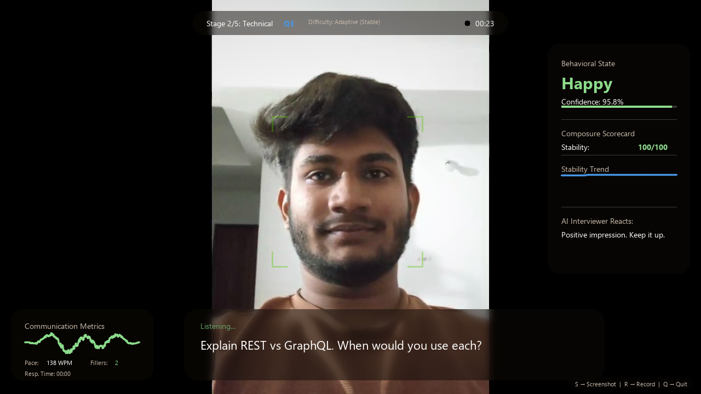
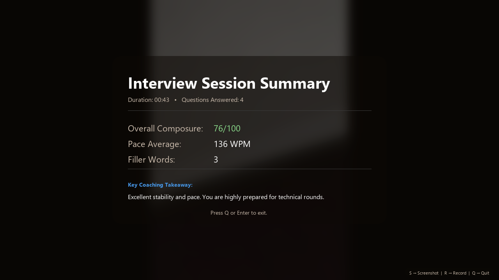

# Developer Portfolio

A responsive personal portfolio website built to showcase academic projects, technical skills, and computer science foundations. The application features a dark-theme design with custom navigation, interactive project cards, and sections detailing coursework and certifications. It is optimized for fast load times and configured for deployment on Vercel.

## Features

* **Interactive Project Cards**: Showcases academic projects with descriptive summaries, technology tags, and direct links to code and live demos.
* **Categorized Skills Directory**: Lists technical proficiencies grouped by category, including languages, frontend frameworks, backend technologies, developer tools, and core computer science areas.
* **Academic & Certification Records**: Dedicated sections highlighting core computer science curriculum topics and external certifications.
* **Responsive Layout**: Designed for mobile and desktop screens with a collapsible navigation drawer for smaller viewports.
* **Contact Integration**: Simple navigation blocks containing verified links to email, GitHub, and LinkedIn profiles.

## Tech Stack

* **Frontend**: React 19, HTML5, CSS3, Tailwind CSS 4
* **Build Tool**: Vite
* **Linting**: ESLint
* **Hosting**: Vercel

## Project Structure

* `src/` - Application source code.
  * `App.jsx` - Main React component containing data, layouts, interactive states, and page sections.
  * `index.css` - Global CSS styling imports and Tailwind CSS directives.
  * `main.jsx` - JavaScript entry point.
* `public/` - Static assets served directly by the web server.
* `screenshots/` - Directory containing images used in project previews.
* `index.html` - Application entry point template.
* `vite.config.js` - Configuration file for Vite.
* `package.json` - Project metadata, dependencies, and scripts.

## Installation

### Prerequisites
Before running the application, make sure Node.js (version 18 or higher) and npm are installed on your system. A Python virtual environment is not required since this is a Node.js-based project.

### Setup Steps
1. Clone the repository:
   ```bash
   git clone https://github.com/abhishekjayagond/portfolio.git
   cd portfolio
   ```

2. Install the project dependencies:
   ```bash
   npm install
   ```

3. Start the local development server:
   ```bash
   npm run dev
   ```

4. Build the application for production:
   ```bash
   npm run build
   ```

## Screenshots

Below are screenshots from the interactive interview simulator project featured in the portfolio layout:





## Future Improvements

* **Contact Form Backend**: Replace mailto links with an API-based contact form (e.g., using Formspree or EmailJS) to improve user interaction.
* **Markdown Blog Section**: Integrate a local markdown parser to allow posting technical notes or project writeups directly on the site.
* **Theme Customization**: Add CSS variable overrides to allow the user to toggle between light and dark themes.
* **Automated Component Tests**: Write integration tests using Vitest and Playwright to verify contact link targets and mobile navigation behavior.
